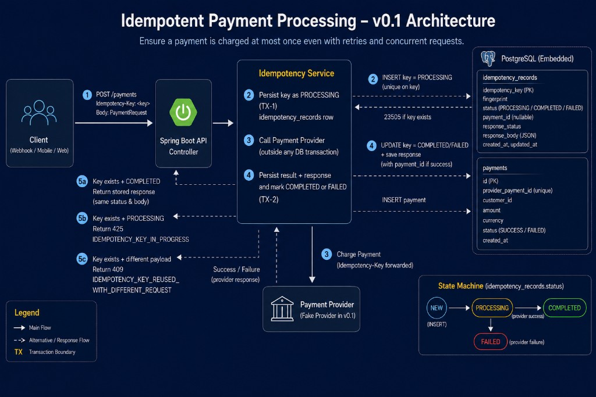

# Idempotent Payment Processing

A distributed-systems lab: payment retries must not charge twice.

## Problem

Clients retry payment requests because of:

- network timeouts
- gateway retries
- user retries
- client crashes

Without idempotency:

```text
retry
   -> another payment
   -> customer may be charged twice
```

## Solution

```text
Idempotency-Key
      +
request fingerprint
      +
database uniqueness
      +
persisted response
```

The database uniqueness constraint on `idempotency_key` is the lock. Not a
`ConcurrentHashMap`, not `synchronized`, not “check then insert” in Java.

## Architecture



HTTP **425** `IDEMPOTENCY_KEY_IN_PROGRESS` is an API design choice: a concurrent
retry while the winner is still `PROCESSING` must not look like a completed
charge.

## Flow

```text
Request
   |
   v
Idempotency-Key
   |
   v
Fingerprint request
   |
   v
Attempt DB claim
   |
   +---- existing key + different fingerprint ---> 409
   |
   +---- existing COMPLETED / FAILED ------------> replay stored response
   |
   +---- existing PROCESSING ---------------------> 425 PROCESSING
   |
   +---- new key
             |
             v
         PROCESSING   (transaction 1 commits)
             |
             v
       Fake Provider  (no DB transaction held)
             |
             v
      persist response
             |
             v
         COMPLETED    (transaction 2 commits)
```

v0.1 hypotheses for this lab: the fake provider is called **only** by the
request that successfully inserted `PROCESSING`. Concurrent losers re-read
the row and must not invoke the provider.

## Example

```bash
curl -sS -D - http://localhost:8080/payments \
  -H 'Content-Type: application/json' \
  -H 'Idempotency-Key: abc123' \
  -d '{"customerId":"cust-123","amount":2500,"currency":"INR"}'
```

First call: HTTP 201, a `paymentId`, provider counter +1.

Same key and body: HTTP 201, **same** `paymentId`, provider counter unchanged.

Same key, different `amount`: HTTP 409 `IDEMPOTENCY_KEY_REUSED_WITH_DIFFERENT_REQUEST`.

Concurrent same key while the first call is still `PROCESSING`: HTTP 425
`IDEMPOTENCY_KEY_IN_PROGRESS`. Retry after completion to replay the stored
body.

## Quick Start

Java 21. Embedded PostgreSQL starts with the app (no Docker required for tests).

```bash
export JAVA_HOME="/opt/homebrew/opt/openjdk@21"
export PATH="$JAVA_HOME/bin:$PATH"

./mvnw test
./mvnw spring-boot:run
```

## Transaction boundaries

**Transaction 1:** insert `idempotency_records` in `PROCESSING`, **COMMIT**.

**External:** call the fake payment provider. No database transaction is open.

**Transaction 2:** insert `payments`, store HTTP status + response body, set
`COMPLETED` or `FAILED`, **COMMIT**.

Holding a DB transaction or row lock across an external call is dangerous:
long-running locks, connection-pool exhaustion, poor throughput, extra
deadlock risk, and unbounded wait on network latency.

## Database uniqueness and concurrency

Ownership is `PRIMARY KEY (idempotency_key)`.

Concurrent inserts of the same key: exactly one insert commits. The others
fail the uniqueness constraint, re-read the winner, and never call the
provider.

A JVM lock or `ConcurrentHashMap` only protects one process:

```text
Client
   |
Load Balancer
  / \
Pod A   Pod B
Map A   Map B
```

The same `Idempotency-Key` can land on both pods. Restarts, reschedules, and
deployments drop in-memory maps. Durable shared storage + a uniqueness
constraint are required.

## Request fingerprint

SHA-256 of canonical DTO fields (`customerId`, `amount`, `currency`) joined
with a stable separator. Not a JSON string: field order and whitespace would
make the same logical payment look like a different request (false 409) or
collapse different payments into one (false replay).

## Crash window (not solved)

1. Service stores `PROCESSING`
2. Calls provider
3. Provider charges the customer
4. Process crashes
5. `COMPLETED` was never persisted

The local table cannot prove whether the external side effect happened.
A real payment system also needs **provider-side idempotency keys**,
**reconciliation**, or **durable workflow / outbox** coordination.

This lab forwards the same `Idempotency-Key` into the fake provider to show
that pattern. It does **not** implement exactly-once delivery to arbitrary
external systems.

## State machine

```text
new key
   |
   v
PROCESSING
   |
   +---- provider success ----> COMPLETED
   |
   +---- definite provider failure ----> FAILED
```

No lease, no stale-PROCESSING sweeper, no automatic retry of `FAILED` in v0.1.
Replay of `COMPLETED` / `FAILED` returns the stored HTTP status and body.

## Limitations

- Fake provider only; no real payment gateway
- No distributed messaging
- No reconciliation worker
- No stale `PROCESSING` recovery / lease
- No production authentication
- No exactly-once guarantee across arbitrary external systems
- Embedded PostgreSQL for the lab, not a production cluster
- Small educational lab, not a payment platform

## Design notes

[docs/DESIGN.md](docs/DESIGN.md)
